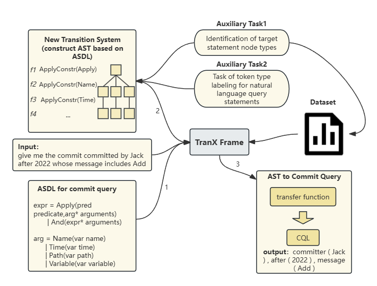

# TranX-Commit

To support convenient commit queries by developers, we extends the **[TranX model](https://github.com/pcyin/tranX)** to
a TranX-Commit that can automatically translate natural language queries into structured commit query statements in
CQL. 


## G4 file for Commit Query Language(CQL)
```
grammar CommitQuery;
query
: ’ ’* criteria (’ ’+ criteria)* ’ ’* EOF
;
criteria
: beforeCriteria
| afterCriteria
| committerCriteria
| authorCriteria
| pathCriteria
| messageCriteria
;
beforeCriteria: ’before’
afterCriteria: ’after’
committerCriteria: ’committer’
authorCriteria: ’author’
pathCriteria: ’path’
messageCriteria: ’message’
```
## System Architecture

TranX-Commit uses abstract syntax trees (ASTs) defined in the 
Abstract Syntax Description Language (ASDL) as intermediate meaning
representation.



Figure 1 gives a brief overview of the system.

1. TranX-Commit first employs a transition system to transform a natural language utterance into a sequence of tree-constructing actions, following the input grammar specification of the target formal language. The grammar specification is provided by users in textual format (e.g., `asdl/lang/commit/commit_asdl.txt` for CQL grammar).

2. The tree-constructing actions produce an intermediate abstract syntax tree. TranX-Commit uses ASTs defined under the ASDL formalism as general-purpose, intermediate meaning representations.

3. The intermediate AST is finally transformed to a domain-specific representation (e.g., CQL) using customly-defined conversion functions.

**File Structure** tranX-Commit is mainly composed of two components: 


Here is a detailed map of the file strcuture:
```bash
├── asdl (grammar-based transition system)
├── datasets (dataset specific code like data preprocessing/evaluation/etc.)
├── model (PyTorch implementation of neural nets)

```

## Usage


```bash
git clone https://github.com/wfbreezee/tranX
cd tranX

bash ./pull_data.sh  # get datasets and pre-trained models

conda env create -f config/env/tranx.yml  # create conda Python environment.

./asdl/lang/commit/dataset.py  #convert a dataset into pickled file

./scripts/commit/train.sh 0  # train on commit dataset

```

## FAQs


#### How to generate those pickled datasets (.bin files)?

Please refer to `asdl/lang/commit/dataset.py` for code snippets that converts 
a dataset into pickled files. 

#### How to run without CUDA?

Simply remove the `--cuda`` flag from the command line arguments. It is included
by default in all scripts in the `scripts` directory.

## Reference

TranX is described/used in the following two papers:

```
@inproceedings{yin18emnlpdemo,
    title = {{TRANX}: A Transition-based Neural Abstract Syntax Parser for Semantic Parsing and Code Generation},
    author = {Pengcheng Yin and Graham Neubig},
    booktitle = {Conference on Empirical Methods in Natural Language Processing (EMNLP) Demo Track},
    year = {2018}
}

@inproceedings{yin18acl,
    title = {Struct{VAE}: Tree-structured Latent Variable Models for Semi-supervised Semantic Parsing},
    author = {Pengcheng Yin and Chunting Zhou and Junxian He and Graham Neubig},
    booktitle = {The 56th Annual Meeting of the Association for Computational Linguistics (ACL)},
    url = {https://arxiv.org/abs/1806.07832v1},
    year = {2018}
}
```


